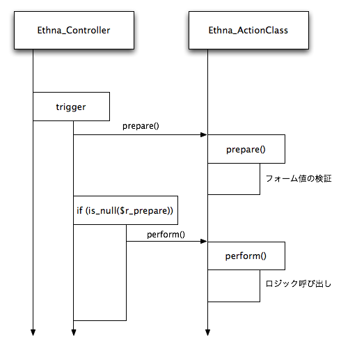

.. _reference_action:

ActionClass
===================

`Ethna` の `ActionClass` (アクションクラス) は `MVC` モデルでいうところの `C (Controller)` の一部です。

ユーザのリクエストによってアプリケーションが起動され、指定されたアクションが実行されます。アクションでは、ロジックの呼び出しを (場合によっては複数回) 行い、遷移先 (\ `ViewClass`\ ) の決定をします。

アクションの仕組み
--------------------

`ActionClass` の決定は、デフォルトでは、次のようなルールで行われます。 ( :ref:`reference_urlhandler` を使ったり、 :ref:`reference_action_formname` などによって変更できます)

1. フォーム名のうち、名前が ``action_`` で始まり、且つフォーム値が空ではないものを探します
2. 1.に該当するフォーム名が見つかった場合、そこから先頭の ``action_`` を除いた部分をアクション名とします

例えば、 ::

    http://example.com/?action_sample=true

という URL にアクセスされた場合、決定されるアクション名は `Sample` となります。

アクションは、主に次の役割を持っています:

* フォーム値のバリデーションを実行し、エラーなどがあった場合に遷移先 (\ `ViewClass`\ ) を決定する
* ロジックの呼び出しを行い、遷移先 (\ `ViewClass`\ ) を決定する

アクションの生成
--------------------

`ActionClass` は、 `ethnaコマンド` を用いて次のように生成します。 ::

    $ ethna add-action sample

このとき、

このコマンドによって、次にようにファイルが生成されます。 ::

    $ ethna add-action sample

すると、次のように出力され、 ``app/action/Sample.php`` ファイルが生成されます。 ::

    file generated [/path/to/sample/skel/skel.action.php -> /path/to/sample/app/action/Sample.php]
    action script(s) successfully created [/path/to/sample/app/action/Sample.php]

生成されたファイルには、指定した `ActionClass` と、対になる `ActionForm` が定義されます。アクション名とファイルは次のように、 ``_`` 区切りがディレクトリ区切りに対応します。

=============  =============================  =========================
アクション名   ファイル                       クラス名
=============  =============================  =========================
index          app/action/Index.php           Sample_Action_Index
post_confirm   app/action/Post/Confirm.php    Sample_Action_PostConfirm
post_do        app/action/Post/Do.php         Sample_Action_PostDo
=============  =============================  =========================

参考:

* :ref:`reference_command-add-action`

`ActionForm` には、次の 2 つのメソッド ``prepare()`` と ``preform()`` が定義されます。 ::

    class Sample_Action_Sample extends Sample_ActionClass
    {
        public function prepare()
        {
        }

        public function perform()
        {
            return 'sample';
        }
    }

prepare()
--------------------

``prepare()`` は、フォームの検証などを行う、 ``prepare()`` メソッドを実行する準備をするためのメソッドです。何事もなければ ``null`` を返し (あるいは ``return`` を省略し)、バリデーションの結果エラーが存在する場合には、遷移名を ``return`` することで、 ``perform()`` メソッドを実行せずに、任意の `ViewClass` や `Template` に遷移させることができます。 

次の例では、フォーム値を検証し (\ ``$this->af->validate()``\ )、エラーが1つ以上ある場合、 `error` という名前の遷移先に遷移するよう、 ``'error'`` という文字列を ``return`` しています。 ::

    public function prepare()
    {
        if ($this->af->validate() > 0) {
            return 'error';
        }
    }

``prepare()`` メソッドと ``preform()`` メソッドの関係は以下のようになっていて、まず ``prepare()`` メソッドが呼ばれ、 ``prepare()`` メソッドが ``null`` を返した場合のみ ``perform()`` メソッドが呼び出されます。

要するに、 ``prepare()`` メソッドでフォーム値の検証を行うこと、 ``perform()`` メソッドでは全てのデータがバリデート済みであるという前提で処理を行うことが出来、安全且つ簡潔なコードが書けるというわけです。

なお、フォーム値の自動検証詳細については以下をご覧下さい。

* :ref:`reference_actionform`

perform()
--------------------

``perform()`` メソッドは、ロジックを処理するためのメソッドです。

遷移先
--------------------

遷移先とは、アクション実行後に呼び出される `ViewClass` (または `Template`\ ) のことです。

`ActionClass` では、ここで説明した ``prepare()`` メソッド、 ``perform()`` メソッドと、 :ref:`reference_action_authenticate` の頁で説明する ``authenticate()`` メソッドの戻り値が遷移名となり、この遷移名に該当する `ViewClass` や `Template` が呼び出されます。

注意すべきこと
--------------------

すでに説明したとおり、 `Ethna` の `ActionClas` は、コントローラの一部です。

よくある `Ethna` による開発での間違いは、 `ActionClass` の ``preform()`` などに、非常に大きな・複雑なロジックを書いてしまうことです。肥大化した `ActionClass` は、アプリケーションの見通しを悪くし、メンテナンス性を著しく悪化させます。ロジックは `AppManager` や `AppObject` に記述します。

ActionClass に関するコンテンツ
----------------------------------

.. toctree::
   :maxdepth: 3
   :titlesonly:
   :glob:

   action/authenticate
   action/nameresolve
   action/formname
   action/formnamereason
