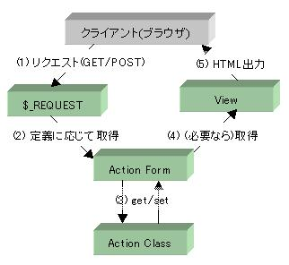
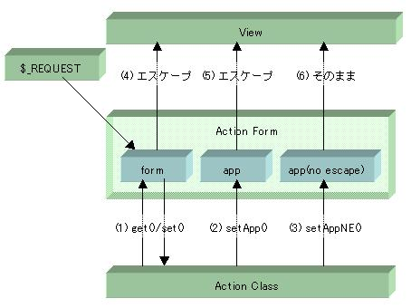

.. _reference_actionform:

ActionForm
=======================

ここでは、HTML フォームや URL パラメータと、送信されたその値の取り扱いについての詳しい解説をします。
`ActionForm` は `Ethna` を使いこなす鍵となるでしょう。

アクションクラスからフォーム値へのアクセスするイメージは以下のようになっています。

#. ブラウザから `GET` あるいは `POST` により渡された値が、PHP によって ``$_GET`` あるいは ``$_POST`` 変数に格納されます

#.  `ActionForm` オブジェクトは、フォーム値として定義されている値のみ ``$_GET`` あるいは ``$_POST`` から取得して、オブジェクト内のコンテナに格納します [#ref1]_

#. アクションクラスオブジェクトは、 `ActionForm` の ``get()`` / ``set()`` メソッドを通じてフォーム値にアクセスし、処理を行います

#. ビューオブジェクトは、 `ActionForm` から必要な値を取得して出力に反映して、

#. HTMLを出力します

`ActionForm` の概要
------------------------------

次に `ActionForm` とは何か、について簡単にご説明します。 `ActionForm` は、Ethnaでは、

* フォーム値
* アクションクラスがビューに渡したい値 (強制エスケープ)
* アクションクラスがビューに渡したい値 (エスケープなし)

という3種類の値のコンテナだと考えて下さい。以下のようなイメージです。

#. フォーム値には ``get()`` / ``set()`` メソッドでアクセスします

#. アプリケーション設定値(フォーム値以外で、ビューに表示させたいダイナミックな値)は ``setApp()`` メソッドで `ActionForm` に格納します

#. アプリケーション設定値(HTMLエスケープさせたくない値)は ``setAppNE()`` メソッドで `ActionForm` に格納します

#. フォーム値はテンプレートで ::

    {$form.フォーム名}

   としてアクセスします。値は常にHTMLエスケープされます。

#. アプリケーション設定値( ``setApp()`` で格納されたもの)はテンプレートで ::

    {$app.変数名}

   としてアクセスします。値は常にHTMLエスケープされます。

#. アプリケーション設定値( ``setAppNE()`` で格納されたもの)はテンプレートで ::

    {$app_ne.変数名}

   としてアクセスします。この値はHTMLエスケープされません。
   不特定多数の入力する値をこのようにエスケープせずに出力することは、推奨されません。エスケープせずに出力する値は、限定された入力 (例えば、管理者の入力など) に限るべきでしょう。

なお、 `ActionForm` はアクションクラスと対になって必ず生成され、 ``prepare()`` あるいは ``perform()`` メソッド、また、 `ViewClass` の ``preforward()`` では必ず ::

    $this->af // 面倒なら$this->afでも可

でアクセスできることが保証されています。アクションクラスに対応する `ActionForm` が未定義の場合は、フォーム値定義の無いデフォルトの `ActionForm` が生成されます。

コンテンツ
-------------------

.. toctree::
   :maxdepth: 3
   :titlesonly:
   :glob:

   actionform/define
   actionform/file
   actionform/array
   actionform/multiarray
   actionform/validation
   actionform/filter
   actionform/customcheck
   actionform/complexvalidation
   actionform/errormsg
   actionform/formtemplate

注釈
-------------------

.. [#ref1] Ethnaでは基本的に、クライアントから送信され `ActionForm` に格納されたフォーム値が `GET` / `POST` ( `REQUEST_METHOD` )のどちらに由来するかを区別しません。理由は、 `GET` / `POST` で振舞いを変えていると思わぬところでダサダサな振舞いをしたり、場合によっては(ここは `GET` しかこないと思い込んでコードを書いていたりすると)セキュリティホールになる可能性もなくもなくも無いためです
